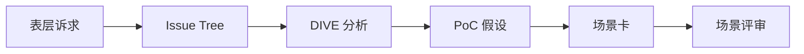

# Consultative-Problem-Solving — 工作流

## 总览

## 第 1 步：诉求重述（30min）

- 用客户原话写「他们说要什么」
- 用 FDE 语言写「这可能解决什么业务问题」
- 列出 3 个待验证假设

## 第 2 步：Issue Tree（2h）

- L1：业务目标
- L2：流程/数据/系统/组织
- L3：可行动子问题
- MECE 检查

## 第 3 步：DIVE（2h）

| 阶段 | 输出 |
| --- | --- |
| Diagnose | 根因分类 |
| Identify | 价值类型与优先级 |
| Validate | PoC 假设+指标 |
| Embed | 责任人+流程嵌入点 |

## 第 4 步：场景评审（会议）

- 参会：AIBP + 业务 Owner + FDE
- 决策：做/不做/延期
- 输出：签字场景卡
