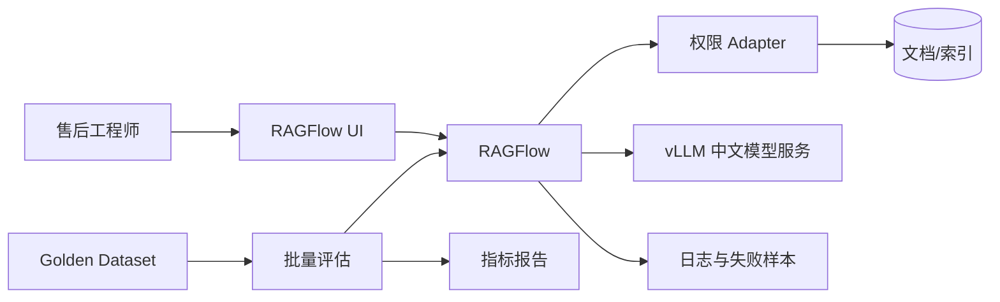

# 验证样例：售后知识库 PoC 技术选型

> 此示例验证 Skill 能否产出明确方案，不替代执行当天的联网检索。模型具体版本、许可证和兼容性必须重新核验。

## 1. 场景

- 用户：20 名售后工程师；
- 数据：500 份中文 PDF，含约 20% 表格、10% 扫描件；
- 安全：数据不出域；
- 环境：1 台 NVIDIA GPU 服务器，Docker 可用；
- 团队：2 名 Python 工程师；
- 周期：10 个工作日；
- 目标：回答必须给出原文引用；
- Primary Metric：答案正确率 ≥80%；
- Guardrail：引用正确率 ≥90%，P95 <8 秒。

## 2. 一句话决策

**主方案：RAGFlow 自托管 + vLLM 模型服务 + 当前获批的中文 Instruct 模型 + Ragas/业务 Golden Dataset；使用企业批准的 CodeBuddy 完成权限 Adapter 与评估脚本。**

若 D3 前 RAGFlow 在目标服务器无法稳定解析代表文档或资源占用不可接受，切换到 **MaxKB 自托管 + 同一模型端点 + PaddleOCR 预处理**。

## 3. 路径判断

- 选择 **L1 + 最小 L2**；
- L1 用成熟 RAG 平台验证解析、召回、引用和业务价值；
- L2 只写权限 Adapter、批量评估和结果导出；
- 不进入 L3 自研 RAG，因为 10 日内最重要的是验证文档与答案质量。

## 4. 检索证据要求

执行时至少刷新：

| 候选 | 必查一手资料 | 需确认 |
| --- | --- | --- |
| RAGFlow | 官方 GitHub/Release | 版本、License、依赖、GPU/CPU、解析 |
| MaxKB | 官方 GitHub/Release | 版本、License、模型与 OCR |
| vLLM | 官方文档/Release | 目标模型、GPU、量化兼容 |
| 中文模型 | 官方模型卡/供应商文档 | License、显存、上下文、结构化输出 |
| CodeBuddy | 官方企业数据文档 | 代码保留、训练、审计、网络 |
| Ragas | 官方文档/Release | 指标和版本 |

该表在真实报告中必须补充检索日期和具体版本。

## 5. 候选评分（示意）

| 方案 | 门禁 | 场景20 | 速度20 | 安全15 | 维护15 | 评估10 | 升级10 | 成本5 | 生态5 | 总分 |
| --- | --- | ---: | ---: | ---: | ---: | ---: | ---: | ---: | ---: | ---: |
| RAGFlow 自托管 | 通过 | 19 | 16 | 14 | 11 | 8 | 8 | 3 | 4 | 83 |
| MaxKB 自托管 | 通过 | 14 | 19 | 14 | 13 | 6 | 7 | 5 | 3 | 81 |
| Dify + 自定义解析 | 通过 | 15 | 15 | 13 | 12 | 8 | 9 | 3 | 5 | 80 |
| FastAPI 全自研 RAG | 通过 | 18 | 7 | 14 | 11 | 9 | 10 | 2 | 4 | 75 |

评分不代表普遍排名，只针对本场景。

## 6. 淘汰理由

### Dify + 自定义解析

不是本次主方案：工作流和应用能力强，但当前核心风险是复杂文档解析；额外组合解析服务增加 10 日 PoC 集成量。若下一阶段需要复杂业务工作流，可重新考虑。

### FastAPI 全自研 RAG

不是本次主方案：控制力最高，但团队只有 2 人，周期不足以同时完成解析、检索、UI、追踪和评估。保留为 Beta 中替换关键组件的可能路径。

## 7. 主方案分层技术栈

| 层 | 技术 | 作用 | 理由 |
| --- | --- | --- | --- |
| 文档/RAG | RAGFlow 自托管 | 解析、切分、检索、引用 | 核心风险是复杂中文文档 |
| OCR | RAGFlow 内置；失败样本用 PaddleOCR 对照 | 扫描件 | 用 bake-off 决定是否外置 |
| 模型服务 | vLLM | OpenAI 兼容推理端点 | 复用性与调试路径清晰 |
| 模型 | 经 D1 评测后选定的获批中文 Instruct 模型 | 回答生成 | 具体版本不静态假定 |
| UI | RAGFlow 内置 UI | 内部用户验证 | 不先开发定制前端 |
| 权限 | 最小 FastAPI Adapter | 按部门过滤知识库 | 验证权限路径，不做完整 IAM |
| 评估 | 业务 Golden Dataset + Ragas 辅助 | 正确率、引用与回归 | 业务真值优先 |
| 追踪 | 平台日志 + 评估结果表 | 失败定位 | PoC 最小可观测 |
| 部署 | Docker Compose | 单机内网 | 适合当前规模 |
| Vibe Coding | 获批 CodeBuddy | Adapter、测试、报表 | 中文/企业工作流；仍需人工 Review |

## 8. 架构

## 9. D0-D10

| 日 | 关键动作 | 门禁 |
| --- | --- | --- |
| D0 | 选 30 份代表文档、50 条 Q&A、权限样本 | AIBP 确认 |
| D1 | 刷新检索、安装候选、模型小测 | License/环境通过 |
| D2 | RAGFlow 核心链路 | 能回答并引用 |
| D3 | 解析 bake-off | 不达标则切 MaxKB+OCR |
| D4 | 检索参数与权限 Adapter | 权限无串读 |
| D5 | 跑 50 条基线 | 指标可重复 |
| D6 | 优化最主要失败类型 | 指标改善 |
| D7 | 形成 Demo v1 | 无 P0 |
| D8 | 5 名售后工程师 UAT | 流程可接受 |
| D9 | 回归、成本、风险、备份 | Guardrail 通过 |
| D10 | Go/No-Go | 书面结论 |

## 10. Vibe Coding 边界

允许生成：

- 权限 Adapter 骨架；
- 批量评估脚本；
- 测试夹具和结果报表；
- Docker Compose 的非敏感部分。

必须人工评审：

- 用户/部门权限过滤；
- 文件访问路径；
- 数据库查询；
- 模型与平台密钥；
- Docker 挂载、网络和删除操作。

## 11. PoC→Beta

### 保留

- 代表文档集和 Golden Dataset；
- 权限规则与测试；
- 模型/RAG 评估报告；
- Adapter API 契约；
- 失败样本分类。

### 重写

- AI 生成但覆盖不足的 Adapter；
- 手工创建的账号和知识库；
- 单机临时日志与备份；
- 内置 UI 中无法满足业务体验的部分。

### 新增

- 企业 SSO/RBAC 和审计；
- AI Gateway、限流和内容安全；
- 定时增量同步与文档生命周期；
- Trace、监控、备份、容量和 Runbook；
- 采纳看板与持续评估。
