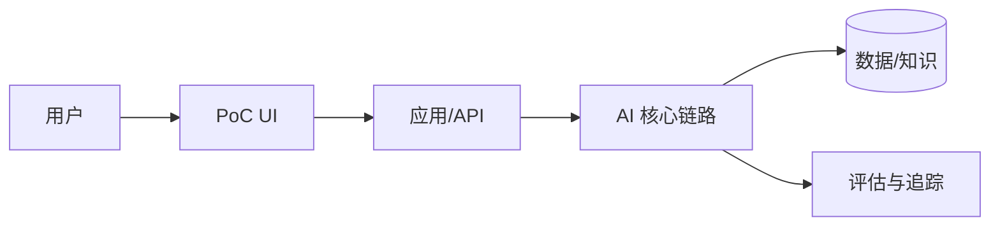

# PoC 技术决策记录（TDR）

## 0. 元信息

- 项目：
- 决策编号：
- 日期：
- 状态：Proposed / Accepted / Superseded / Rejected
- 决策人：
- 评审人：FDE / AIBP / IT安全 / 业务 Owner
- 下次复核日期：

## 1. 一句话决策

选择 **[主方案]** 验证 **[核心假设]**；若 **[触发条件]** 在 **[日期]** 前发生，切换 **[降级方案]**。

## 2. 场景与指标

- 用户与流程：
- If/Then/Because：
- Primary Metric：
- Guardrail Metrics：
- PoC 周期：
- 范围内：
- 范围外：

## 3. 关键约束

| 约束 | 当前结论 | 证据/确认人 |
| --- | --- | --- |
| 数据与出域 |  |  |
| 部署/网络 |  |  |
| 算力/信创 |  |  |
| 集成/权限 |  |  |
| 团队能力 |  |  |
| 预算/周期 |  |  |

## 4. 最新检索证据

| 候选 | 来源 | 检索日期 | 版本/许可 | 关键结论 |
| --- | --- | --- | --- | --- |

## 5. 路径判断

- L1/L2/L3：
- 为什么：
- 为什么不是更简单路径：
- 为什么不是更复杂路径：

## 6. 候选门禁与评分

| 候选 | 硬门禁 | 场景20 | 速度20 | 安全15 | 维护15 | 评估10 | 升级10 | 成本5 | 生态5 | 总分 |
| --- | --- | ---: | ---: | ---: | ---: | ---: | ---: | ---: | ---: | ---: |

## 7. 主方案技术栈

| 层 | 技术 | 用途 | 选择理由 | PoC 后处理 |
| --- | --- | --- | --- | --- |
| 模型/API |  |  |  | 保留/替换 |
| 编排 |  |  |  |  |
| RAG/解析 |  |  |  |  |
| 数据/检索 |  |  |  |  |
| UI/API |  |  |  |  |
| 评估/追踪 |  |  |  |  |
| 部署/网关 |  |  |  |  |
| Vibe Coding |  |  |  |  |

## 8. 降级方案

- 降级技术栈：
- 触发条件：
- 最晚切换日期：
- 可复用资产：
- 切换成本：

## 9. 淘汰方案

### 候选 A

- 淘汰原因：
- 何时可重新考虑：

### 候选 B

- 淘汰原因：
- 何时可重新考虑：

## 10. 架构

## 11. 风险与回退

| 风险 | 预警信号 | 缓解 | 回退 |
| --- | --- | --- | --- |

## 12. PoC→Beta/生产

### 保留

- 

### 重写

- 

### 新增

- 

## 13. 最终批准

| 角色 | 结论 | 姓名/日期 |
| --- | --- | --- |
| AIBP |  |  |
| FDE |  |  |
| IT/安全 |  |  |
| 业务 Owner |  |  |
