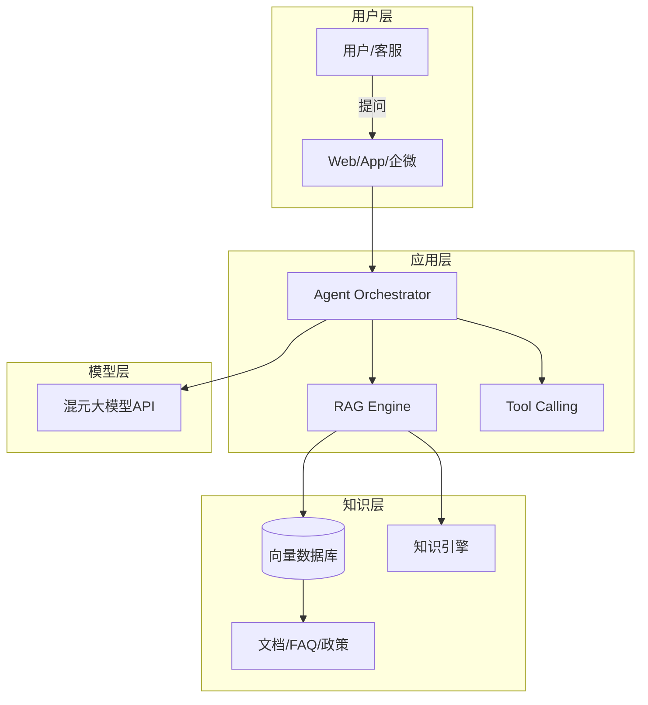
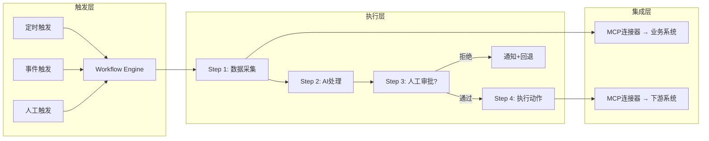
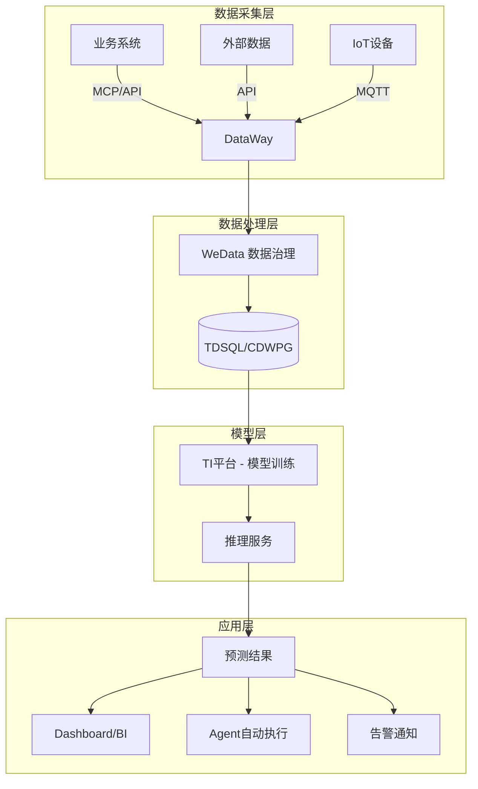
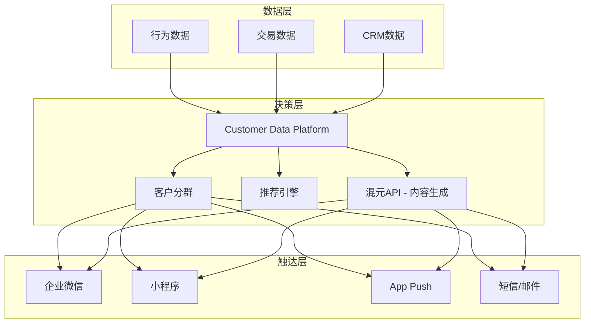
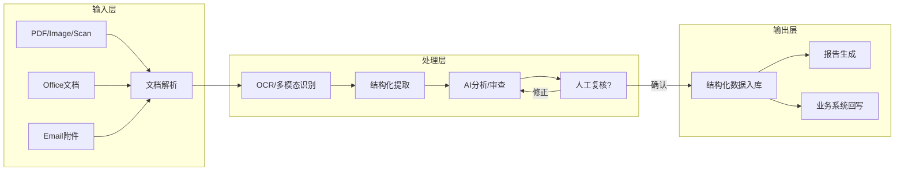
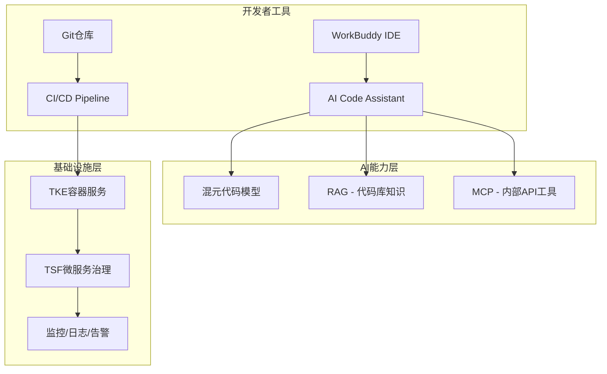

# 解决方案架构模式库

> 最后更新：2026-04-15
> 当确定方案方向后，从此库中选择最匹配的架构模式作为起点。

---

## 模式1：智能问答型（AI-Powered Q&A）

**适用场景**：企业知识管理、智能客服、内部助手

**架构图模板**：

**产品组合**：混元API + 向量DB/知识引擎 + WorkBuddy Agent + MCP连接器（对接业务系统）

---

## 模式2：流程自动化型（Process Automation）

**适用场景**：重复性人工操作替代、审批流自动化、报告生成

**架构图模板**：

**产品组合**：WorkBuddy Skill + Automation + MCP连接器 + 混元API（AI处理步骤）

---

## 模式3：智能预测型（Predictive Intelligence）

**适用场景**：供应链预测、需求预测、异常检测、风险评估

**架构图模板**：

**产品组合**：DataWay + WeData + TI平台 + TDSQL/CDWPG + WorkBuddy Agent（自动化执行）

---

## 模式4：全渠道营销型（Omnichannel Marketing）

**适用场景**：智能营销、客户旅程编排、个性化推荐

**架构图模板**：

**产品组合**：混元API（内容生成）+ DataWay（数据汇聚）+ 向量DB（用户画像）+ WorkBuddy Automation（触达编排）

---

## 模式5：智能文档处理型（Intelligent Document Processing）

**适用场景**：合同审查、票据识别、报告自动生成、合规检查

**架构图模板**：

**产品组合**：混元多模态 + WorkBuddy插件(PDF/XLSX) + 知识引擎 + TDSQL

---

## 模式6：研发效能平台型（Developer Platform）

**适用场景**：研发工具链升级、AI辅助开发、DevOps平台

**架构图模板**：

**产品组合**：WorkBuddy + 混元代码 + TKE + TSF + 向量DB（代码库RAG）

---

## 模式选择指引

| 客户核心诉求 | 推荐模式 | 典型行业 |
|------------|---------|---------|
| "想让员工/客户能智能问答" | 模式1: 智能问答型 | 金融、医疗、教育 |
| "有大量重复人工操作想自动化" | 模式2: 流程自动化型 | 制造、物流、行政 |
| "想提前预测XX来做决策" | 模式3: 智能预测型 | 零售、供应链、金融 |
| "想做精准营销/提升转化" | 模式4: 全渠道营销型 | 零售、电商、教育 |
| "每天处理大量纸质/PDF文档" | 模式5: 智能文档处理型 | 金融、法律、政务 |
| "想提升研发团队效率" | 模式6: 研发效能平台型 | 科技、互联网 |

**混合模式**：大多数真实项目是2-3个模式的组合。例如泡泡玛特供应链项目 = 模式3(预测) + 模式2(自动补货) + 模式1(数据问答)。
