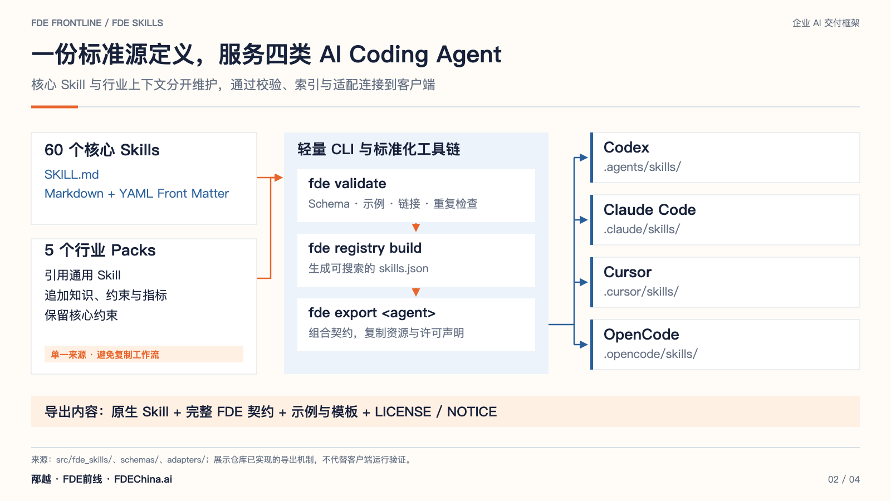
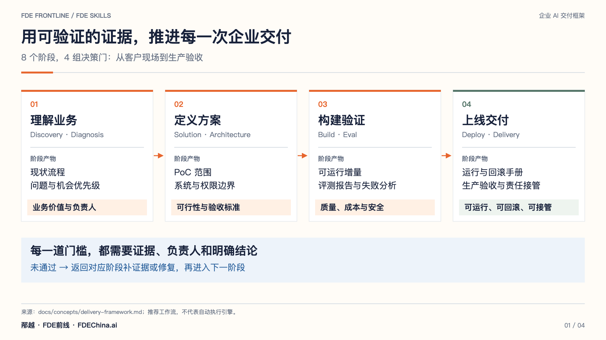
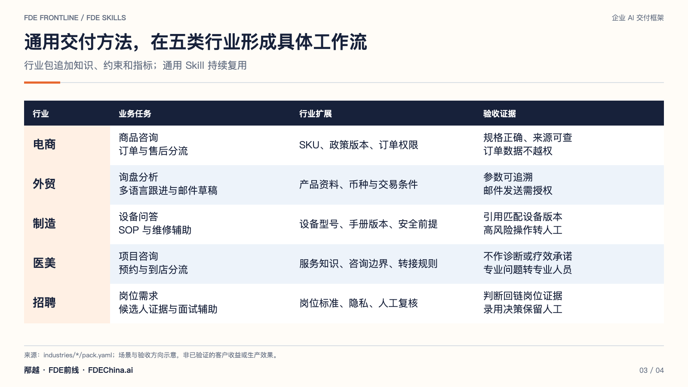
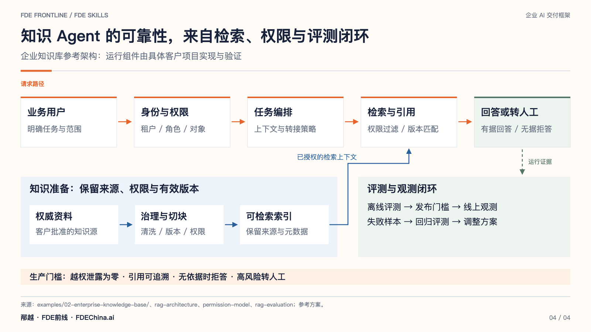

# FDE Skills


**面向 Forward Deployed Engineer 与企业 AI 落地工程师的开源技能库和交付框架。**

[](LICENSE)
[](pyproject.toml)
[](https://github.com/bingyue/fde-skills/actions/workflows/ci.yml)

**简体中文** · [English](README_EN.md) · [FDEChina.ai](https://fdechina.ai/) · [全部 Skill](INDEX.md) · [使用文档](docs/getting-started/quickstart.md) · [参与贡献](CONTRIBUTING.md)

面向 **Forward Deployed Engineer / 企业 AI 落地工程师**的开源 **Skill Library 与 Delivery Framework**。让 Codex、Claude Code、Cursor、OpenCode 等 AI Coding Agent 按照标准化 FDE 方法，完成企业需求诊断、方案设计、开发、评测、部署和交付。

**FDE Skills 不只是教 AI 怎么写代码，而是教 AI 如何像一个 Forward Deployed Engineer 一样进入企业、理解业务、设计方案、构建系统、验证价值并完成交付。**

| 核心原则 | 实践要求 |
| --- | --- |
| **Business First** | 先理解业务流程、相关方和业务价值，再设计 AI。 |
| **Evaluation Driven** | 所有 AI 应用必须可评估、可验证，有明确的验收标准与失败用例。 |
| **From PoC to Production** | 面向真实企业生产落地，从一开始就考虑部署、运维、回滚与责任接管。 |

## 可以用它做什么

- 从客户需求出发，形成企业诊断、AI 场景地图、PoC 范围和交付计划。
- 设计企业知识库、RAG、Agent、工具、权限模型与人工复核流程。
- 构建评测数据集，验证检索、幻觉、任务成功率、安全与成本。
- 准备部署上线、生产验收、服务等级和交付移交。
- 复用行业知识，将真实项目经验沉淀为可持续维护的 Skill。

## 当前能力

| 模块 | 已实现内容 |
| --- | --- |
| 核心 Skills | **60 个，覆盖 12 类**；包含结构化契约、工作流、质量门槛、交付模板与正反例 |
| 行业 Packs | **5 个**：电商、外贸、制造、医美、招聘 |
| Agent Adapters | **4 个**：Codex、Claude Code、Cursor、OpenCode，共用一份标准源定义 |
| 交付案例 | **5 个端到端案例**、40 份阶段产物、60 条可运行的合成评测 |
| 工程设施 | Python CLI、JSON Schema、可搜索的 [Registry](skills.json)、自动校验与 CI |

Skill 的 `ready` 状态表示已编写并通过结构校验，不代表经过客户现场验证。案例数据和评测结果默认属于合成教学样本，真实验证须另行记录证据。

## 项目架构



图中展示仓库已实现的工具链。原生客户端的运行表现仍需独立验证；[查看全部图解与可编辑源文件](docs/visuals/README.md)。

## 快速开始

需要 **Python 3.10+**。在本仓库目录执行：

```bash
python3 -m venv .venv
source .venv/bin/activate
python -m pip install -e '.[dev]'

fde list
fde search rag
fde show enterprise-ai-diagnosis
fde validate
```

Windows PowerShell 使用 `.venv\Scripts\Activate.ps1` 激活虚拟环境。

将 Skill 导出到已有项目：

```bash
fde export codex --skill enterprise-ai-diagnosis --output ../customer-project
fde export claude-code --industry foreign-trade --output ../customer-project
fde export cursor --skill rag-architecture --output ../customer-project
fde export opencode --skill delivery-handover --output ../customer-project
```

导出内容包括平台原生 `SKILL.md`、完整 FDE 契约、示例、模板和许可声明。CLI 在本地运行，无需模型调用或密钥。平台目录和导出行为详见[适配说明](docs/getting-started/adapters.md)。

## Skill 如何工作

每个标准 Skill 位于 `skills/<category>/<name>/SKILL.md`。Markdown 正文与 YAML Front Matter 共同定义使用场景、输入、输出、工作流、约束、工具和评测标准；配套文件提供完整示例和交付模板。

```text
需求 → Discovery → Diagnosis → Solution → Architecture → Build → Eval → Deploy → Delivery
```

每个阶段都需要证据、负责人和明确的通过或不通过结论。缺少输入时输出缺口清单，评测失败时先修复再推进。详见[交付框架](docs/concepts/delivery-framework.md)和 [FDE Skill Specification](docs/skill-spec/README.md)。



| 分类 | 代表 Skills |
| --- | --- |
| discovery · 需求发现 | customer-discovery、field-observation、industry-research |
| diagnosis · 企业诊断 | enterprise-ai-diagnosis、pain-point-analysis |
| solution · 方案设计 | requirement-to-poc、poc-scope、technical-solution-design |
| architecture · 系统架构 | system-architecture、rag-architecture、permission-model |
| knowledge · 知识工程 | source-inventory、knowledge-base-design、retrieval-strategy |
| agent · 智能体设计 | agent-design、workflow-design、human-in-the-loop |
| ontology · 业务本体 | ontology-design |
| engineering · 工程实现 | evaluation-driven-development、mcp-design、observability-design |
| evaluation · 评测验证 | rag-evaluation、tool-calling-evaluation、prompt-regression |
| deployment · 部署上线 | docker-deployment、private-deployment、poc-to-production |
| delivery · 企业交付 | enterprise-acceptance、sla-design、delivery-handover |
| business · 商业价值 | roi-assessment、ai-opportunity-mapping、enterprise-ai-pricing |

完整的 60 个 Skills 见[索引](INDEX.md)，也可以使用 `fde search <关键词>` 查找。

## 行业扩展与交付案例

行业 Pack 引用核心 Skill，追加行业知识、约束、指标、术语和案例，避免重复维护相同流程。机制详见[行业 Pack 规范](docs/skill-spec/industry-packs.md)。

| 行业 Pack | 重点方向 |
| --- | --- |
| [电商](industries/ecommerce/README.md) | 商品知识、客户服务与运营 |
| [外贸](industries/foreign-trade/README.md) | 询盘、客户跟进、产品知识、多语言客服和邮件草稿 |
| [制造](industries/manufacturing/README.md) | 设备知识、质检、SOP、维修、供应链与生产数据 |
| [医美](industries/medical-beauty/README.md) | 服务信息、咨询分流、预约与合规边界 |
| [招聘](industries/recruitment/README.md) | 岗位要求、候选人证据、面试辅助与人工复核 |



每个案例都包含 Discovery、Diagnosis、Solution、Architecture、Build、Eval、Deploy、Delivery 的完整过程：

1. [企业 AI 诊断](examples/01-enterprise-ai-diagnosis/README.md)
2. [企业知识库](examples/02-enterprise-knowledge-base/README.md)
3. [外贸销售 Agent](examples/03-foreign-trade-sales-agent/README.md)
4. [医美咨询与预约 Agent](examples/04-medical-beauty-conversion-agent/README.md)
5. [制造业知识 Agent](examples/05-manufacturing-knowledge-agent/README.md)

```bash
python scripts/run_example.py 02-enterprise-knowledge-base
```

案例可以离线复现，包含故意失败的基线，用于演示契约和交付门槛。生产模型质量与业务效果仍需使用真实系统和经过授权的数据验证。

### 应用参考架构：企业知识 Agent



这张图展示可由 Skills 指导设计的应用架构。运行组件由客户项目实现与验证；本仓库提供方法、契约、模板和离线示例。

## 仓库结构

```text
fde-skills/
├── skills/          # 12 类标准 Skill 源定义
├── industries/      # 5 个行业扩展包
├── adapters/        # Codex、Claude Code、Cursor、OpenCode 适配配置
├── templates/       # Skill 模板与交付记录
├── examples/        # 5 个完整交付案例
├── schemas/         # Skill、示例和行业 Pack 的 JSON Schema
├── src/fde_skills/   # CLI 与离线案例基线
├── scripts/         # 校验、索引与案例执行入口
├── tests/           # 契约、CLI、适配与回归测试
├── docs/            # 概念、规范、教程与迁移历史
├── legacy/          # 保留的历史资产与上游声明
└── skills.json      # 自动生成的搜索与集成 Registry
```

## 参与贡献

欢迎用中文或英文参与：完善 Skill、补充经过验证的失败案例、扩展行业 Pack、改进 Adapter，或修正文档。从[贡献指南](CONTRIBUTING.md)和[如何贡献自己的 FDE Skill](docs/getting-started/contribute-a-skill.md)开始。

```bash
fde skill create supplier-onboarding --category discovery
# 完善草稿、交付模板和正反例后，再生成索引。
fde registry build
fde validate
pytest -q
ruff check src tests scripts setup.py
```

`fde skill create` 不带名称时进入交互；`fde init ./my-library` 可初始化独立的 Skill 库。统一维护 `skills/` 源文件，再生成衍生产物。问题与提案请提交 [Issue](https://github.com/bingyue/fde-skills/issues)，代码和内容改进请提交 [Pull Request](https://github.com/bingyue/fde-skills/pulls)。

## Roadmap

| 阶段 | 方向 | 当前状态 |
| --- | --- | --- |
| Phase 1 | 50+ Core Skills | 已实现首批 60 个 Skills |
| Phase 2 | Industry Skill Packs | 已提供 5 个初始行业包，持续补充现场验证 |
| Phase 3 | Codex / Claude Code / Cursor / OpenCode Adapters | 已实现 4 类导出，客户端运行验证仍待完善 |
| Phase 4 | FDE Blueprint Integration | 规划中 |
| Phase 5 | Skill Registry / Marketplace | 已有本地 Registry，Marketplace 待建设 |

查看[完整 Roadmap](ROADMAP.md)、[更新日志](CHANGELOG.md)和[验证记录](docs/verification.md)。

## 作者与社区

**作者 / 维护者：[邴越（Bing Yue）](https://github.com/bingyue)。** 欢迎 FDE 社区共同建设和维护。

- **[FDEChina.ai · FDE中国社区](https://fdechina.ai/)**：企业 AI 落地案例、方法、学习资源与社区交流入口。
- **FDE前线**：微信公众号、视频号，搜索 **「FDE前线」** 关注。
- **[FDE Skills GitHub 仓库](https://github.com/bingyue/fde-skills)**：获取源码、使用 Skills、提交提案和参与贡献。

欢迎工程师、业务实践者与行业专家，把项目经验转化为可复用、可验证的 FDE Skills。仓库问题通过 GitHub 协作，FDE 方法与实践交流可以通过社区参与。

## 开源协议

Copyright © 2026 **邴越（Bing Yue）及 FDE Skills 贡献者**。

当前原创的 FDE Skills 库、CLI、文档、模板和示例采用 **GNU Affero General Public License v3.0 only（`AGPL-3.0-only`）**，完整条款见 [LICENSE](LICENSE)。

修改后的受许可程序若支持用户通过网络远程交互，须按照 AGPL 第 13 条向这些用户提供获取对应源代码的机会。分发和其他要求以许可证全文为准。

历史第三方材料保留原有条款，不进入受支持的安装包和 Adapter 导出；此前已授予的许可不会被撤销。来源与适用范围见 [NOTICE](NOTICE.md)、[来源记录](SOURCES.md)及[迁移记录](docs/migration/README.md)。
