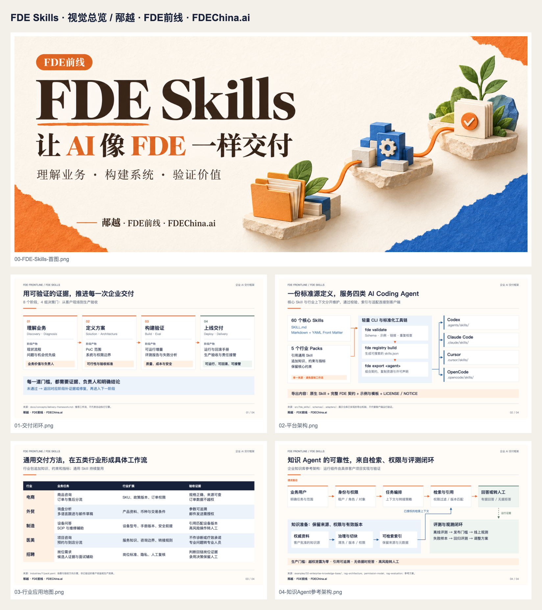

# FDE Skills 视觉资产 / Visual assets

首图沿用 FDE前线近期的暖白纸感、橙蓝强调与模块化物件视觉；正文图采用结论式标题、清楚分层、统一网格与来源页脚，适合 README、技术方案和演示文稿。

署名统一为 **邴越 · FDE前线 · FDEChina.ai**。

## 图集

| 图 | 要回答的问题 | 中文 | English | 可编辑源文件 |
| --- | --- | --- | --- | --- |
| 首图 | FDE Skills 的定位是什么？ | [PNG](../assets/visuals/00-FDE-Skills-首图.png) | 共用品牌首图 / Shared brand cover | [生成提示词](cover-prompt.txt) |
| 交付闭环 | 如何用证据推进交付？ | [PNG](../assets/visuals/01-交付闭环.png) | [PNG](../assets/visuals/01-delivery-framework.png) | [中文 SVG](../assets/visuals/01-交付闭环.svg) · [English SVG](../assets/visuals/01-delivery-framework.svg) |
| 平台架构 | 一份 Skill 如何适配四类 Agent？ | [PNG](../assets/visuals/02-平台架构.png) | [PNG](../assets/visuals/02-platform-architecture.png) | [中文 SVG](../assets/visuals/02-平台架构.svg) · [English SVG](../assets/visuals/02-platform-architecture.svg) |
| 行业应用 | 通用方法如何应用到五类行业？ | [PNG](../assets/visuals/03-行业应用地图.png) | [PNG](../assets/visuals/03-industry-applications.png) | [中文 SVG](../assets/visuals/03-行业应用地图.svg) · [English SVG](../assets/visuals/03-industry-applications.svg) |
| 知识 Agent | 检索、权限与评测如何配合？ | [PNG](../assets/visuals/04-知识Agent参考架构.png) | [PNG](../assets/visuals/04-knowledge-agent.png) | [中文 SVG](../assets/visuals/04-知识Agent参考架构.svg) · [English SVG](../assets/visuals/04-knowledge-agent.svg) |



## 内容边界

- 平台架构图描述当前仓库已实现的 CLI、校验、索引和文件导出机制。
- 交付闭环是一条推荐方法路径，各阶段保留评测失败后的修复与回退。
- 行业应用图展示 Pack 中的任务和验收方向，没有收益率或客户落地数量等推测数据。
- 知识 Agent 图是应用参考架构，运行组件由具体客户项目实现并验证。

## 编辑与重建

图解为 **1600 × 900（16:9）**，中英文各四张，同时提供 PNG 和 SVG。使用 SVG 可在演示文稿中保持清晰，也可以编辑文字与结构。首图通过内置 `image_gen` 生成，保留原始 PNG 和提示词，不提供伪造的矢量源文件。

图解的共同编辑源是 [render.cjs](render.cjs)。修改其中的内容与布局后运行渲染脚本，会重新生成八张图解及联系表；不覆盖首图。脚本检查每段文字的宽度和画布边界，超出限制会终止。

需要 Node.js 18+、Playwright、Chromium，以及 PingFang SC、Noto Sans CJK SC 或 Microsoft YaHei 中至少一种中文字体。可复用本机已有环境，或将渲染依赖安装到独立临时目录：

```bash
npm install --prefix /tmp/fde-skills-visual-tools --no-save --no-package-lock playwright
/tmp/fde-skills-visual-tools/node_modules/.bin/playwright install chromium
NODE_PATH=/tmp/fde-skills-visual-tools/node_modules node docs/visuals/render.cjs
```

Linux 环境需要可用的中文字体（例如 Noto Sans CJK SC）和 Chromium 系统依赖。字体和浏览器版本会影响 PNG 字形，SVG 与脚本保留可维护的布局源。

查看[图片来源与许可](图片来源.md)、[质量记录](qa-report.md)、[渲染报告](render-report.json)。视觉材料适用项目 [AGPL-3.0-only](../../LICENSE) 与 [NOTICE](../../NOTICE.md)。

## English

The shared cover follows the FDE前线 editorial identity. Four diagrams are available in both Chinese and English, with PNG previews and editable SVG sources. All carry the attribution **邴越 · FDE前线 · FDEChina.ai**.

The platform diagram describes the implemented export toolchain; the knowledge-agent diagram is a reference design for customer projects. Edit `render.cjs` and use the commands above to regenerate diagrams. Node.js, Playwright, Chromium and a CJK font are needed only for visual maintenance, not normal CLI use. The AI-generated cover is a raster asset, with its prompt recorded separately.
